# Terraform microservice

This project realize a microservice with the following infrastructure.

```mermaid
architecture-beta

group microservice[Microservice]

service api-gw(logos:aws-api-gateway)[API Gateway] in microservice
service authorizer(logos:aws-lambda)[Authorizer] in microservice
service server(logos:aws-lambda)[Server] in microservice
service ddb(logos:aws-dynamodb)[Config DB] in microservice
service db(logos:aws-aurora)[Codes DB] in microservice

api-gw:R --> L:server
api-gw:B --> T:authorizer
authorizer:R --> L:ddb
server:B --> T:ddb
server:R --> L:db
```

Requirements:

- infra is deployed to AWS and use AWS services;
- infra is entirely defined using Terraform; the only exception are the databases, which are already existent and the functions only connect to them;
- infra is deployed using CI/CD pipelines leveraging GitHub actions;
- Lambda functions are all written in TypeScript;
- the Codes DB is a SQL Server. The connection to this DB is made using Prisma ORM V7;
- the Config DB is DynamoDB database.
- lambda functions (and possibly API endpoints) should be testable locally (using Docker if possible). This must include testing the DBs locally (both Dynamo and SQL Server).
